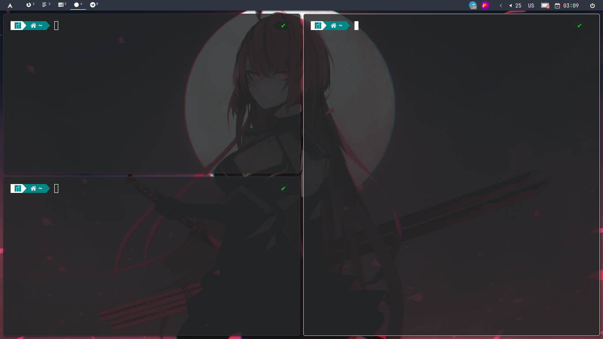
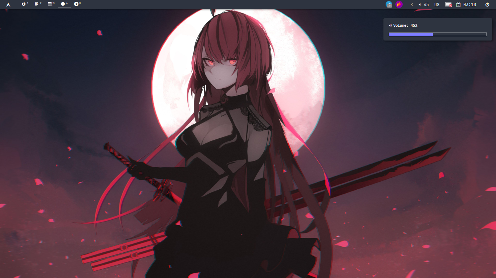
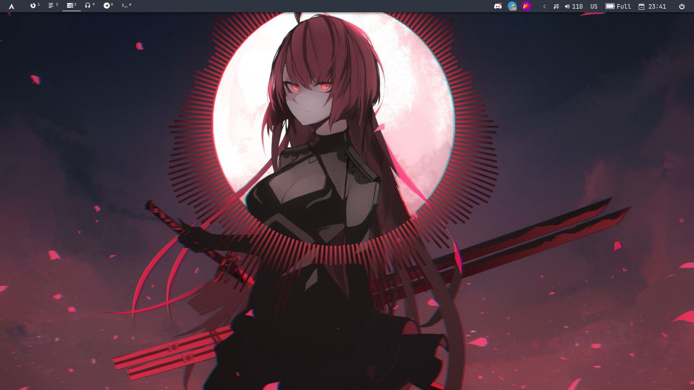

# My dotfiles

My WM and other programs config. Qtile config with some own widgets.

List of my widgets:
 - YT Music widget based on my [YT Music API plugin](https://github.com/AndrewOmelnitsky/youtube-music).

 - WidgetGroup - widget for grouping other widgets.

 - WidgetBox - remake of base `WidgetBox` for better usage.

 - BaseWidgetTabGroup - base widget for switching between some widgets. Usage of this widget you can see in `HoveringWidgetTabGroup`.

 - HoveringWidgetTabGroup - widget that changes one widget to another and back on hover.

 - Brightness - own widget for changing brightness.

 - Volume - own widget for changing volume.

 - ColorPicker - widget that contains 2 other widgets:
    - ColorPickerDropper - widget for picking color with `xcolor`.

    - ColorPickerPalette - widget for displaying picked color.

## Dependencies

List of dependencies: 
 - Qtile == 0.22.1
 - Alactity
 - qtile-extras
 - glava

## Examples

