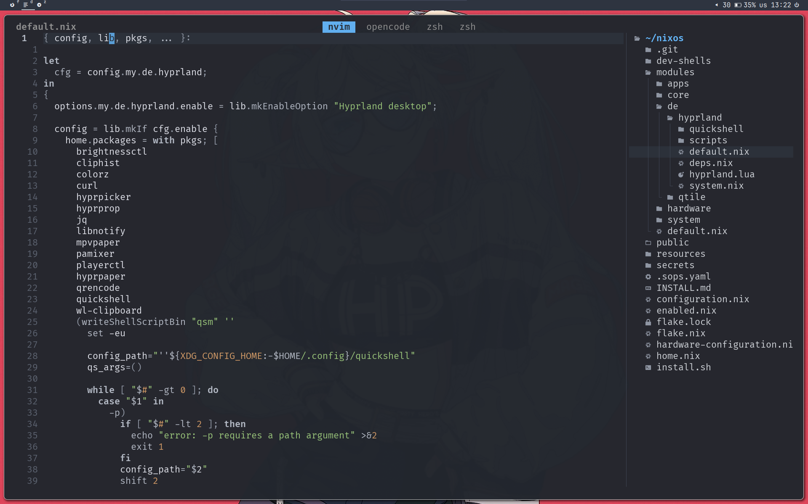

# Dotfiles



See [INSTALL.md](./INSTALL.md) for fresh-machine bootstrap details.

## Development

```sh
make dev
make fmt
make check
make test
make update
make switch
make pre-commit-all
```

`nix develop` installs the generated pre-commit hooks. Formatting is handled by
treefmt-nix; pre-commit checks also run Nix, Python, shell, QML, and spelling linters.

Install from a directory containing `keys.txt`:

```sh
nix --extra-experimental-features 'nix-command flakes' shell nixpkgs#curl -c sh -c 'curl -fsSL https://raw.githubusercontent.com/blackgolyb/.dotfiles/refs/heads/nixos/install.sh | sh'
```
